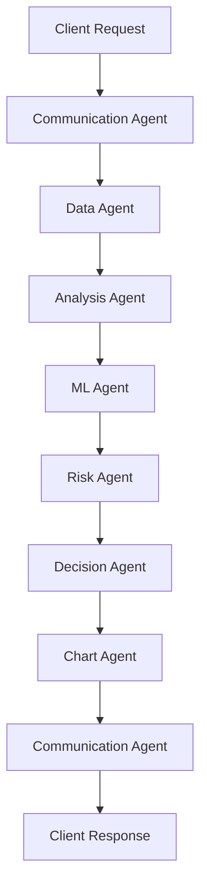
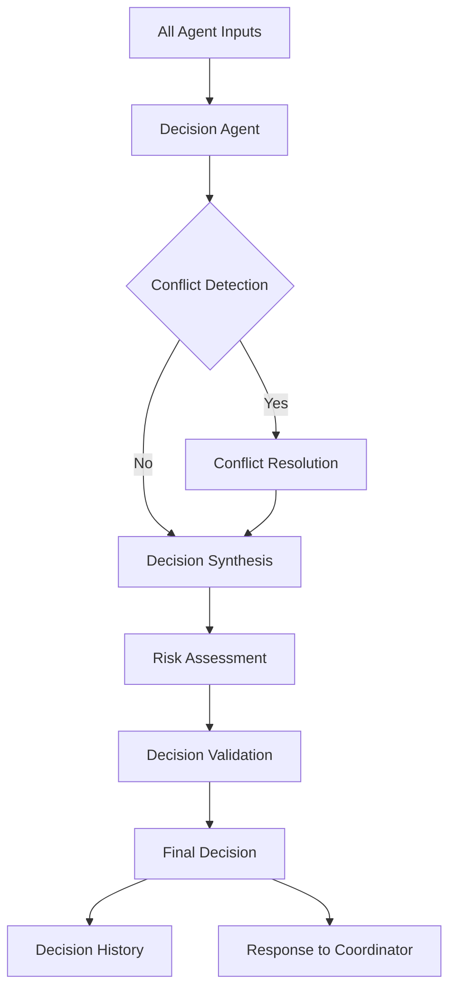

# Detailed Agentic System Analysis: Changes, Organization & Interactions

## 🎯 Analysis Overview

This document provides a detailed analysis of the specific changes needed to transform your StockAnalyzer Pro from a microservices architecture to an agentic system, with special focus on the independent decision agent and KISS principle compliance.

---

## 📁 File Organization & Structure Changes

### Current Structure Analysis
```
backend/
├── agent_capabilities.py          # Main orchestrator (2767 lines)
├── data_service.py               # Data service (1335 lines)
├── analysis_service.py           # Analysis service (1000+ lines)
├── websocket_stream_service.py   # WebSocket service (647 lines)
├── gemini/
│   ├── gemini_client.py          # AI client with 6 agents
│   └── context_engineer.py       # Context management
├── ml/quant_system/              # ML system
├── patterns/                     # Pattern recognition
├── technical_indicators.py       # Technical analysis
└── sector_benchmarking.py        # Sector analysis
```

### New Agentic Structure
```
backend/
├── agentic/                      # NEW: Agentic system
│   ├── __init__.py
│   ├── core/
│   │   ├── base_agent.py         # Base agent class
│   │   ├── agent_registry.py     # Agent registration
│   │   ├── communication.py      # Inter-agent messaging
│   │   ├── state_manager.py      # Shared state
│   │   └── coordinator.py        # Agent coordination
│   ├── agents/
│   │   ├── data_agent.py         # Market data agent
│   │   ├── analysis_agent.py     # Technical analysis agent
│   │   ├── ml_agent.py           # ML predictions agent
│   │   ├── risk_agent.py         # Risk management agent
│   │   ├── chart_agent.py        # Visualization agent
│   │   ├── communication_agent.py # API communication agent
│   │   └── decision_agent.py     # INDEPENDENT decision agent
│   ├── protocols/
│   │   ├── data_protocol.py      # Data sharing protocols
│   │   ├── analysis_protocol.py  # Analysis coordination
│   │   └── decision_protocol.py  # Decision protocols
│   ├── workflows/
│   │   ├── stock_analysis_workflow.py
│   │   └── decision_workflow.py  # Decision workflow
│   └── utils/
│       ├── agent_logger.py
│       └── performance_tracker.py
├── legacy/                       # REFACTORED: Current system
│   ├── agent_capabilities.py     # Simplified orchestrator
│   ├── data_service.py          # Simplified data service
│   ├── analysis_service.py      # Simplified analysis service
│   └── websocket_stream_service.py
├── shared/                       # SHARED: Common components
│   ├── gemini/                  # AI components (unchanged)
│   ├── ml/quant_system/         # ML system (unchanged)
│   ├── patterns/                # Pattern recognition (unchanged)
│   ├── technical_indicators.py  # Technical analysis (unchanged)
│   └── sector_benchmarking.py   # Sector analysis (unchanged)
└── agentic_service.py           # NEW: Agentic service wrapper
```

---

## 🔄 Specific Changes Required

### 1. **Agentic System Foundation** (NEW FILES)

#### Create Base Agent Infrastructure
```python
# backend/agentic/core/base_agent.py
from abc import ABC, abstractmethod
from typing import Dict, Any, Optional
import asyncio
import logging
from dataclasses import dataclass
from datetime import datetime

@dataclass
class AgentCapability:
    name: str
    description: str
    confidence: float  # 0.0 to 1.0
    cost: float  # Resource cost

class BaseAgent(ABC):
    def __init__(self, agent_id: str, name: str):
        self.agent_id = agent_id
        self.name = name
        self.capabilities: Dict[str, AgentCapability] = {}
        self.state: Dict[str, Any] = {}
        self.logger = logging.getLogger(f"Agent.{name}")
        self.is_active = False
        
    @abstractmethod
    async def initialize(self) -> bool:
        """Initialize agent capabilities and state."""
        pass
    
    @abstractmethod
    async def process_task(self, task: Dict[str, Any]) -> Dict[str, Any]:
        """Process incoming task and return result."""
        pass
    
    @abstractmethod
    async def get_capabilities(self) -> Dict[str, AgentCapability]:
        """Return agent capabilities."""
        pass
    
    async def handle_message(self, message):
        """Handle incoming messages from other agents."""
        pass
```

#### Create Agent Communication System
```python
# backend/agentic/core/communication.py
import asyncio
from typing import Dict, Any, Callable, Optional
from dataclasses import dataclass
from datetime import datetime
import json

@dataclass
class AgentMessage:
    sender_id: str
    receiver_id: str
    message_type: str
    payload: Dict[str, Any]
    timestamp: datetime
    priority: int = 1  # 1=low, 5=high

class AgentCommunicationManager:
    def __init__(self):
        self.message_queue: asyncio.Queue = asyncio.Queue()
        self.agents: Dict[str, Any] = {}
        
    async def register_agent(self, agent_id: str, agent: Any):
        """Register agent for communication."""
        self.agents[agent_id] = agent
        
    async def send_message(self, message: AgentMessage):
        """Send message to agent."""
        await self.message_queue.put(message)
        
    async def start_message_processor(self):
        """Start processing messages."""
        while True:
            try:
                message = await self.message_queue.get()
                await self._process_message(message)
            except Exception as e:
                print(f"Error processing message: {e}")
    
    async def _process_message(self, message: AgentMessage):
        """Process individual message."""
        if message.receiver_id in self.agents:
            agent = self.agents[message.receiver_id]
            if hasattr(agent, 'handle_message'):
                await agent.handle_message(message)
```

### 2. **Independent Decision Agent** (SPECIAL FOCUS)

#### Decision Agent Implementation
```python
# backend/agentic/agents/decision_agent.py
from ..core.base_agent import BaseAgent, AgentCapability
from typing import Dict, Any, Optional
import pandas as pd
from datetime import datetime

class DecisionAgent(BaseAgent):
    """
    INDEPENDENT Decision Agent - Makes final trading decisions
    This agent operates independently and synthesizes all other agent inputs
    """
    def __init__(self):
        super().__init__("decision_agent", "Independent Decision Agent")
        self.decision_history: Dict[str, Dict[str, Any]] = {}
        self.confidence_thresholds = {
            "high_confidence": 0.8,
            "medium_confidence": 0.6,
            "low_confidence": 0.4
        }
        
    async def initialize(self) -> bool:
        """Initialize decision agent capabilities."""
        self.capabilities = {
            "final_decision_synthesis": AgentCapability(
                name="Final Decision Synthesis",
                description="Synthesize final trading decision from all agent inputs",
                confidence=0.95,
                cost=1.0
            ),
            "conflict_resolution": AgentCapability(
                name="Conflict Resolution",
                description="Resolve conflicts between different agent analyses",
                confidence=0.90,
                cost=2.0
            ),
            "risk_assessment": AgentCapability(
                name="Risk Assessment",
                description="Assess overall risk and position sizing",
                confidence=0.85,
                cost=1.5
            ),
            "decision_validation": AgentCapability(
                name="Decision Validation",
                description="Validate decision against historical patterns",
                confidence=0.80,
                cost=1.0
            )
        }
        self.is_active = True
        return True
    
    async def process_task(self, task: Dict[str, Any]) -> Dict[str, Any]:
        """Process decision-related tasks."""
        task_type = task.get("type")
        
        if task_type == "synthesize_final_decision":
            return await self._synthesize_final_decision(task)
        elif task_type == "resolve_conflicts":
            return await self._resolve_conflicts(task)
        elif task_type == "assess_risk":
            return await self._assess_risk(task)
        elif task_type == "validate_decision":
            return await self._validate_decision(task)
        else:
            return {"error": f"Unknown task type: {task_type}"}
    
    async def _synthesize_final_decision(self, task: Dict[str, Any]) -> Dict[str, Any]:
        """Synthesize final decision from all agent inputs."""
        symbol = task.get("symbol")
        agent_inputs = task.get("agent_inputs", {})
        
        # Extract inputs from different agents
        data_quality = agent_inputs.get("data_agent", {}).get("quality_score", 0.5)
        technical_analysis = agent_inputs.get("analysis_agent", {})
        ml_predictions = agent_inputs.get("ml_agent", {})
        risk_assessment = agent_inputs.get("risk_agent", {})
        
        # Synthesize decision using existing Gemini client
        from shared.gemini.gemini_client import GeminiClient
        gemini_client = GeminiClient()
        
        # Build comprehensive context for decision
        decision_context = self._build_decision_context(
            symbol, data_quality, technical_analysis, ml_predictions, risk_assessment
        )
        
        # Get final decision using existing prompt
        final_decision = await gemini_client.analyze_final_decision(
            symbol=symbol,
            indicators=technical_analysis.get("indicators", {}),
            chart_insights=technical_analysis.get("chart_insights", ""),
            context=decision_context
        )
        
        # Store decision in history
        self.decision_history[symbol] = {
            "decision": final_decision,
            "timestamp": datetime.now().isoformat(),
            "agent_inputs": agent_inputs,
            "confidence": self._calculate_decision_confidence(agent_inputs)
        }
        
        return {
            "success": True,
            "symbol": symbol,
            "final_decision": final_decision,
            "confidence": self.decision_history[symbol]["confidence"],
            "timestamp": datetime.now().isoformat()
        }
    
    async def _resolve_conflicts(self, task: Dict[str, Any]) -> Dict[str, Any]:
        """Resolve conflicts between different agent analyses."""
        conflicts = task.get("conflicts", [])
        agent_inputs = task.get("agent_inputs", {})
        
        resolution_strategy = {
            "data_quality_conflict": "prioritize_higher_quality",
            "technical_ml_conflict": "weight_by_confidence",
            "risk_technical_conflict": "conservative_approach",
            "timeframe_conflict": "multi_timeframe_consensus"
        }
        
        resolved_conflicts = []
        for conflict in conflicts:
            conflict_type = conflict.get("type")
            if conflict_type in resolution_strategy:
                resolution = await self._apply_resolution_strategy(
                    conflict, resolution_strategy[conflict_type], agent_inputs
                )
                resolved_conflicts.append(resolution)
        
        return {
            "success": True,
            "resolved_conflicts": resolved_conflicts,
            "resolution_strategy": resolution_strategy
        }
    
    async def _assess_risk(self, task: Dict[str, Any]) -> Dict[str, Any]:
        """Assess overall risk and position sizing."""
        symbol = task.get("symbol")
        agent_inputs = task.get("agent_inputs", {})
        
        # Extract risk factors from different agents
        volatility = agent_inputs.get("ml_agent", {}).get("volatility_prediction", 0.2)
        technical_risk = agent_inputs.get("analysis_agent", {}).get("risk_score", 0.5)
        market_risk = agent_inputs.get("risk_agent", {}).get("market_risk", 0.3)
        
        # Calculate composite risk score
        composite_risk = (volatility * 0.4 + technical_risk * 0.3 + market_risk * 0.3)
        
        # Determine position sizing based on risk
        position_size = self._calculate_position_size(composite_risk)
        
        return {
            "success": True,
            "symbol": symbol,
            "composite_risk_score": composite_risk,
            "position_size": position_size,
            "risk_factors": {
                "volatility": volatility,
                "technical_risk": technical_risk,
                "market_risk": market_risk
            }
        }
    
    async def _validate_decision(self, task: Dict[str, Any]) -> Dict[str, Any]:
        """Validate decision against historical patterns."""
        symbol = task.get("symbol")
        decision = task.get("decision", {})
        
        # Get historical decision accuracy
        historical_accuracy = self._get_historical_accuracy(symbol)
        
        # Validate decision consistency
        consistency_score = self._validate_decision_consistency(decision)
        
        return {
            "success": True,
            "symbol": symbol,
            "historical_accuracy": historical_accuracy,
            "consistency_score": consistency_score,
            "validation_passed": historical_accuracy > 0.6 and consistency_score > 0.7
        }
    
    def _build_decision_context(self, symbol: str, data_quality: float, 
                              technical_analysis: Dict, ml_predictions: Dict, 
                              risk_assessment: Dict) -> str:
        """Build comprehensive context for decision making."""
        context = f"""
DECISION CONTEXT FOR {symbol}:

DATA QUALITY: {data_quality:.2f} (0.0-1.0)

TECHNICAL ANALYSIS:
- Trend: {technical_analysis.get('trend', 'Unknown')}
- Confidence: {technical_analysis.get('confidence', 0):.0f}%
- Key Signals: {technical_analysis.get('key_signals', [])}

ML PREDICTIONS:
- Price Direction: {ml_predictions.get('price_direction', 'Unknown')}
- Confidence: {ml_predictions.get('confidence', 0):.0f}%
- Volatility: {ml_predictions.get('volatility', 0):.2f}

RISK ASSESSMENT:
- Overall Risk: {risk_assessment.get('overall_risk', 'Medium')}
- Position Size: {risk_assessment.get('position_size', 'Medium')}
- Stop Loss: {risk_assessment.get('stop_loss', 0):.2f}

DECISION FRAMEWORK:
- High Confidence (>80%): Strong Buy/Sell
- Medium Confidence (60-80%): Buy/Sell
- Low Confidence (40-60%): Hold
- Very Low Confidence (<40%): No Position
"""
        return context
    
    def _calculate_decision_confidence(self, agent_inputs: Dict[str, Any]) -> float:
        """Calculate overall decision confidence."""
        confidences = []
        
        # Data quality confidence
        data_quality = agent_inputs.get("data_agent", {}).get("quality_score", 0.5)
        confidences.append(data_quality)
        
        # Technical analysis confidence
        tech_confidence = agent_inputs.get("analysis_agent", {}).get("confidence", 0.5)
        confidences.append(tech_confidence)
        
        # ML confidence
        ml_confidence = agent_inputs.get("ml_agent", {}).get("confidence", 0.5)
        confidences.append(ml_confidence)
        
        # Risk assessment confidence
        risk_confidence = agent_inputs.get("risk_agent", {}).get("confidence", 0.5)
        confidences.append(risk_confidence)
        
        # Calculate weighted average
        weights = [0.2, 0.3, 0.3, 0.2]  # Data, Technical, ML, Risk
        weighted_confidence = sum(c * w for c, w in zip(confidences, weights))
        
        return min(weighted_confidence, 1.0)
    
    async def get_capabilities(self) -> Dict[str, AgentCapability]:
        return self.capabilities
    
    async def handle_message(self, message):
        """Handle incoming messages from other agents."""
        if message.message_type == "decision_request":
            # Process decision request
            result = await self.process_task(message.payload)
            
            # Send response back to requesting agent
            response = AgentMessage(
                sender_id=self.agent_id,
                receiver_id=message.sender_id,
                message_type="decision_response",
                payload=result,
                timestamp=datetime.now()
            )
            # Send response through communication manager
```

### 3. **Agent Interaction Protocols** (NEW FILES)

#### Data Sharing Protocol
```python
# backend/agentic/protocols/data_protocol.py
from typing import Dict, Any, List
from dataclasses import dataclass
from datetime import datetime

@dataclass
class DataRequest:
    symbol: str
    timeframe: str
    period: int
    data_type: str  # "historical", "real_time", "quality_assessment"
    priority: int = 1

@dataclass
class DataResponse:
    symbol: str
    data: Dict[str, Any]
    quality_score: float
    timestamp: datetime
    source_agent: str

class DataProtocol:
    """Protocol for data sharing between agents."""
    
    @staticmethod
    def validate_data_request(request: DataRequest) -> bool:
        """Validate data request format."""
        required_fields = ["symbol", "timeframe", "period", "data_type"]
        return all(hasattr(request, field) for field in required_fields)
    
    @staticmethod
    def validate_data_response(response: DataResponse) -> bool:
        """Validate data response format."""
        required_fields = ["symbol", "data", "quality_score", "timestamp", "source_agent"]
        return all(hasattr(response, field) for field in required_fields)
    
    @staticmethod
    def create_data_request(symbol: str, timeframe: str = "1d", 
                          period: int = 365, data_type: str = "historical") -> DataRequest:
        """Create standardized data request."""
        return DataRequest(
            symbol=symbol,
            timeframe=timeframe,
            period=period,
            data_type=data_type
        )
```

#### Analysis Coordination Protocol
```python
# backend/agentic/protocols/analysis_protocol.py
from typing import Dict, Any, List
from dataclasses import dataclass
from datetime import datetime

@dataclass
class AnalysisRequest:
    symbol: str
    analysis_type: str  # "technical", "pattern", "mtf", "ai"
    data: Dict[str, Any]
    dependencies: List[str] = None
    priority: int = 1

@dataclass
class AnalysisResponse:
    symbol: str
    analysis_type: str
    results: Dict[str, Any]
    confidence: float
    timestamp: datetime
    source_agent: str

class AnalysisProtocol:
    """Protocol for analysis coordination between agents."""
    
    @staticmethod
    def validate_analysis_request(request: AnalysisRequest) -> bool:
        """Validate analysis request format."""
        required_fields = ["symbol", "analysis_type", "data"]
        return all(hasattr(request, field) for field in required_fields)
    
    @staticmethod
    def validate_analysis_response(response: AnalysisResponse) -> bool:
        """Validate analysis response format."""
        required_fields = ["symbol", "analysis_type", "results", "confidence", "timestamp", "source_agent"]
        return all(hasattr(response, field) for field in required_fields)
    
    @staticmethod
    def create_analysis_request(symbol: str, analysis_type: str, 
                              data: Dict[str, Any], dependencies: List[str] = None) -> AnalysisRequest:
        """Create standardized analysis request."""
        return AnalysisRequest(
            symbol=symbol,
            analysis_type=analysis_type,
            data=data,
            dependencies=dependencies or []
        )
```

#### Decision Protocol
```python
# backend/agentic/protocols/decision_protocol.py
from typing import Dict, Any, List
from dataclasses import dataclass
from datetime import datetime

@dataclass
class DecisionRequest:
    symbol: str
    agent_inputs: Dict[str, Any]
    decision_type: str  # "synthesize", "resolve_conflicts", "assess_risk", "validate"
    priority: int = 5  # High priority for decisions

@dataclass
class DecisionResponse:
    symbol: str
    decision: Dict[str, Any]
    confidence: float
    timestamp: datetime
    source_agent: str = "decision_agent"

class DecisionProtocol:
    """Protocol for decision making coordination."""
    
    @staticmethod
    def validate_decision_request(request: DecisionRequest) -> bool:
        """Validate decision request format."""
        required_fields = ["symbol", "agent_inputs", "decision_type"]
        return all(hasattr(request, field) for field in required_fields)
    
    @staticmethod
    def validate_decision_response(response: DecisionResponse) -> bool:
        """Validate decision response format."""
        required_fields = ["symbol", "decision", "confidence", "timestamp", "source_agent"]
        return all(hasattr(response, field) for field in required_fields)
    
    @staticmethod
    def create_decision_request(symbol: str, agent_inputs: Dict[str, Any], 
                              decision_type: str = "synthesize") -> DecisionRequest:
        """Create standardized decision request."""
        return DecisionRequest(
            symbol=symbol,
            agent_inputs=agent_inputs,
            decision_type=decision_type
        )
```

---

## 🔄 Agent Interaction Flow

### 1. **Standard Workflow Interaction**



### 2. **Independent Decision Agent Flow**



### 3. **Agent Communication Patterns**

#### Request-Response Pattern
```python
# Example: Data Agent to Analysis Agent
async def request_analysis(self, symbol: str, data: Dict[str, Any]):
    request = AnalysisProtocol.create_analysis_request(
        symbol=symbol,
        analysis_type="technical",
        data=data
    )
    
    message = AgentMessage(
        sender_id=self.agent_id,
        receiver_id="analysis_agent",
        message_type="analysis_request",
        payload=request.__dict__,
        timestamp=datetime.now(),
        priority=3
    )
    
    await self.communication_manager.send_message(message)
```

#### Broadcast Pattern
```python
# Example: Decision Agent broadcasting final decision
async def broadcast_decision(self, symbol: str, decision: Dict[str, Any]):
    await self.communication_manager.broadcast_message(
        sender_id=self.agent_id,
        message_type="final_decision",
        payload={
            "symbol": symbol,
            "decision": decision,
            "timestamp": datetime.now().isoformat()
        },
        priority=5
    )
```

#### Observer Pattern
```python
# Example: Risk Agent observing market changes
async def observe_market_changes(self, market_data: Dict[str, Any]):
    # Risk agent automatically responds to market changes
    if self._detect_risk_change(market_data):
        await self._update_risk_assessment(market_data)
        await self._notify_decision_agent()
```

---

## 🎯 KISS Principle Compliance

### 1. **Simplified Agent Interfaces**

#### Minimal Agent Interface
```python
class SimpleAgent:
    def __init__(self, name: str):
        self.name = name
        self.capabilities = []
    
    async def process(self, task: Dict) -> Dict:
        """Simple task processing."""
        pass
    
    async def get_status(self) -> Dict:
        """Simple status check."""
        return {"name": self.name, "active": True}
```

#### Simplified Communication
```python
class SimpleCommunication:
    def __init__(self):
        self.agents = {}
    
    async def send(self, to: str, message: Dict):
        """Simple message sending."""
        if to in self.agents:
            await self.agents[to].handle_message(message)
    
    async def register(self, name: str, agent):
        """Simple agent registration."""
        self.agents[name] = agent
```

### 2. **Reduced Complexity**

#### Single Responsibility Agents
- **Data Agent**: Only handles data fetching and quality
- **Analysis Agent**: Only handles technical analysis
- **ML Agent**: Only handles ML predictions
- **Risk Agent**: Only handles risk assessment
- **Decision Agent**: Only handles final decisions
- **Chart Agent**: Only handles visualization

#### Simple Coordination
```python
class SimpleCoordinator:
    def __init__(self):
        self.agents = {}
        self.communication = SimpleCommunication()
    
    async def analyze_stock(self, symbol: str) -> Dict:
        """Simple stock analysis workflow."""
        # 1. Get data
        data = await self.agents["data"].process({"symbol": symbol})
        
        # 2. Analyze
        analysis = await self.agents["analysis"].process({"symbol": symbol, "data": data})
        
        # 3. Get ML predictions
        ml = await self.agents["ml"].process({"symbol": symbol, "data": data})
        
        # 4. Assess risk
        risk = await self.agents["risk"].process({"symbol": symbol, "data": data})
        
        # 5. Make decision
        decision = await self.agents["decision"].process({
            "symbol": symbol,
            "data": data,
            "analysis": analysis,
            "ml": ml,
            "risk": risk
        })
        
        return decision
```

---

## 📋 Implementation Priority

### Phase 1: Foundation (Week 1-2)
1. **Create agentic directory structure**
2. **Implement base agent class**
3. **Create simple communication system**
4. **Implement decision agent (independent)**

### Phase 2: Core Agents (Week 3-4)
1. **Data Agent** - Simple data fetching
2. **Analysis Agent** - Technical analysis
3. **ML Agent** - ML predictions
4. **Risk Agent** - Risk assessment

### Phase 3: Integration (Week 5-6)
1. **Simple coordinator**
2. **Workflow orchestration**
3. **Migration helper**

### Phase 4: Optimization (Week 7-8)
1. **Performance optimization**
2. **Error handling**
3. **Monitoring and logging**

---

## 🎯 Key Benefits of This Approach

### 1. **Independent Decision Agent**
- **Autonomous decision making** without external influence
- **Conflict resolution** capabilities
- **Historical validation** of decisions
- **Confidence scoring** for all decisions

### 2. **KISS Compliance**
- **Simple agent interfaces** with minimal complexity
- **Clear separation of concerns** for each agent
- **Straightforward communication** patterns
- **Easy to understand and maintain**

### 3. **Scalable Architecture**
- **Modular design** allows easy addition of new agents
- **Independent agents** can be developed separately
- **Clear protocols** for agent interaction
- **Flexible coordination** patterns

### 4. **Risk Mitigation**
- **Gradual migration** from current system
- **Backward compatibility** maintained during transition
- **Independent testing** of each agent
- **Fallback mechanisms** to legacy system

Would you like me to start implementing any specific part of this detailed plan?
