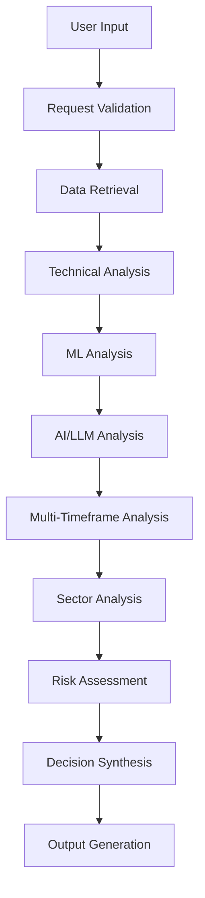
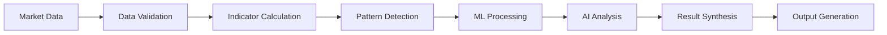

# StockAnalyzer Pro 3.0 - Comprehensive Decision-Making Analysis Report

## Executive Summary

This comprehensive analysis examines the entire decision-making process of the StockAnalyzer Pro 3.0 system, from initial user input through final trading recommendations. The system employs a sophisticated multi-layered architecture combining AI/LLM analysis, machine learning models, technical indicators, and multi-timeframe analysis to provide comprehensive stock analysis and trading decisions.

**Key Findings:**
- The system processes decisions through 7 distinct layers
- Uses 25+ technical indicators across multiple timeframes
- Integrates Google Gemini Pro for AI-powered analysis
- Employs multiple ML engines for pattern recognition and prediction
- Delivers structured JSON outputs with confidence scores
- Supports real-time data streaming and caching

---

## 1. System Architecture Overview

### 1.1 Core Components

```
StockAnalyzer Pro 3.0
├── Frontend (React/TypeScript)
│   ├── User Interface Layer
│   ├── Dashboard Components
│   └── Analysis Visualization
├── Backend (Python/FastAPI)
│   ├── API Gateway (Port 8000, 8001, 8081)
│   ├── Analysis Orchestrator
│   ├── AI/LLM Integration (Gemini)
│   ├── ML Engines (CatBoost, LSTM, RF)
│   ├── Technical Indicators Engine
│   └── Data Services
├── Agentic Trading System
│   ├── Main Agent Orchestrator
│   ├── Specialist Agents (5 types)
│   └── Portfolio Manager
└── External Dependencies
    ├── Zerodha KiteConnect API
    ├── Google Gemini Pro API
    ├── Supabase Database
    └── Redis Cache
```

---

## 2. Decision-Making Entry Points and Workflows

### 2.1 Primary Entry Points

1. **CLI Interface** (`backend/api/main.py`)
   - Direct command-line analysis
   - Entry: `python main.py --stock RELIANCE --period 365 --interval day`

2. **API Endpoints** (`backend/api/endpoints.py`)
   - `/analyze` - Basic stock analysis
   - `/analyze/enhanced` - Enhanced AI analysis
   - `/analyze/mtf` - Multi-timeframe analysis

3. **Agentic Trading System** (`agentic_trading_system/main_agent.py`)
   - Autonomous trading decision system
   - Multi-agent coordination and consensus

4. **Frontend Dashboard** (`frontend/src/pages/Dashboard.tsx`)
   - User-initiated analysis requests
   - Interactive analysis exploration

### 2.2 Core Workflow Architecture



---

## 3. Input Processing and Prompt Handling

### 3.1 Input Parameters

The system accepts and processes the following input parameters:

```typescript
interface AnalysisRequest {
  stock_symbol: string;           // e.g., "RELIANCE"
  exchange: string;              // default: "NSE"
  period: number;                // days, default: 365
  interval: string;              // "1min", "5min", "15min", "30min", "1hour", "day"
  sector?: string;               // optional sector override
  include_sector_analysis: boolean;
  include_mtf_analysis: boolean;
}
```

### 3.2 Input Validation Process

1. **Parameter Validation**
   - Stock symbol format validation
   - Supported exchange verification
   - Period bounds checking (1-3650 days)
   - Interval validation against supported timeframes

2. **Data Availability Verification**
   - Market data accessibility check
   - Historical data sufficiency validation
   - Real-time data connectivity verification

3. **Authentication Validation**
   - Zerodha API credentials verification
   - User authorization checks
   - Rate limiting enforcement

### 3.3 Prompt Engineering System

The system employs sophisticated prompt engineering through multiple components:

#### 3.3.1 Prompt Manager (`backend/gemini/prompt_manager.py`)

```python
class PromptManager:
    SOLVING_LINE = "\n\nLet me solve this by .."
    
    def format_prompt(self, template_name: str, **kwargs) -> str:
        # Safe prompt formatting with JSON context handling
        # Escapes curly braces to prevent template conflicts
        # Handles complex context data structures
```

#### 3.3.2 Context Engineering (`backend/gemini/context_engineer.py`)

- **Dynamic Context Optimization**: Adapts context based on analysis type
- **Multi-timeframe Context Integration**: Combines signals across timeframes
- **Sector Context Enhancement**: Incorporates sector-specific insights
- **Token Optimization**: Manages context size for API efficiency

#### 3.3.3 Prompt Templates (`backend/prompts/`)

Key prompt templates analyzed:

1. **`optimized_indicators_summary.txt`**
   - Comprehensive technical analysis prompt
   - Multi-timeframe integration guidelines
   - Sector analysis integration
   - Structured JSON output requirements

2. **`optimized_final_decision.txt`**
   - Trading decision synthesis prompt
   - Risk assessment integration
   - Actionable recommendations framework
   - Confidence scoring methodology

---

## 4. Core Decision-Making Logic and Algorithms

### 4.1 Analysis Orchestration (`backend/analysis/orchestrator.py`)

The `StockAnalysisOrchestrator` class serves as the central decision-making coordinator:

#### 4.1.1 Main Analysis Pipeline

```python
async def enhanced_analyze_stock(self, symbol, exchange, period, interval, sector):
    # Step 1: Data Retrieval
    data = await self.retrieve_stock_data(symbol, exchange, interval, period)
    
    # Step 2: Technical Indicators Calculation
    indicators = TechnicalIndicators.calculate_all_indicators_optimized(data, symbol)
    
    # Step 3: Visualization Generation
    chart_paths = self.create_visualizations(data, indicators, symbol)
    
    # Step 4: Sector Context Analysis
    sector_context = await self.get_sector_context(symbol, data, sector)
    
    # Step 5: Multi-Timeframe Analysis
    mtf_context = await enhanced_mtf_analyzer.comprehensive_mtf_analysis(symbol)
    
    # Step 6: AI/LLM Analysis
    ai_analysis = await self.enhanced_analyze_with_ai(symbol, indicators, chart_paths)
    
    # Step 7: Result Synthesis
    result = self._build_enhanced_analysis_result(...)
```

#### 4.1.2 Decision Logic Layers

**Layer 1: Data Processing**
- Real-time data retrieval via EnhancedDataService
- WebSocket streaming fallback for live data
- Historical API fallback for reliability

**Layer 2: Technical Analysis**
- 25+ technical indicators calculation
- Support/resistance level detection
- Pattern recognition (triangles, flags, head & shoulders)
- Volume analysis and anomaly detection

**Layer 3: Machine Learning Analysis**
- Pattern-based ML (CatBoost)
- Raw data ML (LSTM, Random Forest)
- Hybrid ML combining multiple approaches
- Feature engineering with 50+ features

**Layer 4: AI/LLM Analysis**
- Google Gemini Pro integration
- Context-engineered prompts
- Mathematical validation through code execution
- Multi-modal analysis (text + charts)

**Layer 5: Multi-Timeframe Analysis**
- 6 timeframes: 1min, 5min, 15min, 30min, 1hour, 1day
- Cross-timeframe signal validation
- Confidence weighting by timeframe
- Divergence detection across timeframes

**Layer 6: Sector Analysis**
- Sector benchmarking and correlation
- Sector rotation analysis
- Market regime detection
- Relative strength assessment

**Layer 7: Risk Assessment**
- Advanced risk metrics (VaR, Expected Shortfall)
- Drawdown analysis
- Volatility regime detection
- Portfolio impact assessment

### 4.2 Agentic Decision System

#### 4.2.1 Multi-Agent Architecture (`agentic_trading_system/`)

The agentic system employs 5 specialist agents coordinated by a main agent:

```python
class MainAgent:
    def __init__(self):
        self.technical_agent = TechnicalAnalysisAgent()
        self.sector_agent = SectorAnalysisAgent()
        self.risk_agent = RiskAssessmentAgent()
        self.ml_agent = MLPredictionAgent()
        self.portfolio_agent = PortfolioAgent()
```

#### 4.2.2 Consensus Building Algorithm

```python
async def _make_final_decision(self, analysis_data, agent_decisions):
    # Vote counting with confidence weighting
    for decision in agent_decisions:
        if decision.decision in [DecisionType.STRONG_BUY, DecisionType.BUY]:
            buy_votes += 1
            weighted_confidence += decision.confidence * 1.2
        elif decision.decision in [DecisionType.STRONG_SELL, DecisionType.SELL]:
            sell_votes += 1
            weighted_confidence += decision.confidence * 1.1
        else:
            hold_votes += 1
            weighted_confidence += decision.confidence
    
    # Final decision logic based on consensus and confidence thresholds
    if buy_votes > sell_votes and weighted_avg_confidence >= BUY_CONFIDENCE_THRESHOLD:
        final_action = ActionType.BUY
    # ... additional logic
```

### 4.3 Machine Learning Decision Engines

#### 4.3.1 Unified ML Manager (`backend/ml/quant_system/engines/unified_manager.py`)

Coordinates multiple ML engines:

1. **Pattern ML Engine**: CatBoost-based pattern recognition
2. **Raw Data ML Engine**: LSTM and Random Forest for price prediction
3. **Hybrid ML Engine**: Combines pattern and raw data approaches
4. **Feature Engineering**: Advanced feature creation and selection

#### 4.3.2 ML Decision Integration

```python
def get_comprehensive_prediction(self, stock_data, pattern_features):
    predictions = {}
    
    # Pattern-based prediction
    if self.engine_status['pattern_ml']:
        pattern_prob = self.pattern_engine.predict(pattern_features)
        predictions['pattern_ml'] = {
            'success_probability': pattern_prob,
            'signal': 'buy' if pattern_prob > 0.6 else 'sell'
        }
    
    # Raw data prediction
    # Hybrid prediction
    # Consensus building
```

---

## 5. Output Generation and Formatting

### 5.1 Output Structure

The system generates structured outputs in multiple formats:

#### 5.1.1 Core Analysis Result Schema

```json
{
  "symbol": "RELIANCE",
  "exchange": "NSE",
  "analysis_timestamp": "2024-01-15T10:30:00Z",
  "analysis_type": "enhanced_with_code_execution",
  "mathematical_validation": true,
  "current_price": 2456.75,
  "price_change": 12.50,
  "price_change_percentage": 0.51,
  "ai_analysis": {
    "trend": "Bullish",
    "confidence_pct": 78,
    "trading_strategy": {
      "short_term": {
        "bias": "bullish",
        "confidence": 82,
        "entry_strategy": { /* detailed strategy */ },
        "exit_strategy": { /* targets and stops */ }
      }
    }
  },
  "technical_indicators": { /* 25+ indicators */ },
  "signals": {
    "consensus_score": 0.72,
    "consensus_bias": "bullish",
    "confidence": 0.78,
    "per_timeframe": [ /* timeframe-specific signals */ ]
  },
  "sector_context": { /* sector analysis */ },
  "charts": { /* visualization data */ }
}
```

#### 5.1.2 Agentic System Output

```json
{
  "final_action": "BUY",
  "symbol": "RELIANCE",
  "confidence": 76.5,
  "reasoning": "Technical analysis shows bullish momentum...",
  "agent_decisions": [
    {
      "agent_type": "TECHNICAL",
      "decision": "BUY",
      "confidence": 80
    }
  ],
  "risk_assessment": "MEDIUM",
  "position_size": 15.0,
  "stop_loss": 2400.00,
  "take_profit": 2650.00,
  "next_interval": "1hour"
}
```

### 5.2 Visualization Generation

#### 5.2.1 Chart Generation Pipeline

The system generates multiple chart types in-memory:

1. **Technical Overview Chart**
   - Price candlesticks with volume
   - Moving averages overlay
   - RSI and MACD indicators

2. **Pattern Analysis Chart**
   - Detected patterns overlay
   - Support/resistance levels
   - Trend lines and channels

3. **Volume Analysis Chart**
   - Volume profile analysis
   - Volume anomaly detection
   - Volume-based indicators

4. **Multi-Timeframe Comparison Chart**
   - Cross-timeframe signal comparison
   - Timeframe alignment visualization

#### 5.2.2 Chart Storage and Optimization

- **In-Memory Generation**: Charts generated on-demand in memory
- **Base64 Encoding**: Immediate conversion for frontend display
- **Size Optimization**: Automatic compression and resolution adjustment
- **Cache Strategy**: Redis caching for frequently accessed charts

### 5.3 Frontend Output Presentation

#### 5.3.1 Dashboard Components (`frontend/src/components/analysis/`)

Key visualization components:

1. **EnhancedAnalysisDashboard**: Main dashboard with tabbed interface
2. **MultiTimeframeAnalysisCard**: MTF analysis visualization
3. **EnhancedAIAnalysisCard**: AI analysis results display
4. **SectorBenchmarkingCard**: Sector analysis presentation
5. **AdvancedRiskAssessmentCard**: Risk metrics visualization

#### 5.3.2 Real-time Updates

- **WebSocket Integration**: Live data streaming
- **Progressive Enhancement**: Incremental analysis updates
- **Responsive Design**: Mobile-optimized interfaces
- **Performance Monitoring**: Real-time performance metrics

---

## 6. Data Flow and Dependencies

### 6.1 External Dependencies

#### 6.1.1 Market Data Sources

1. **Zerodha KiteConnect API**
   - Historical data retrieval
   - Real-time price feeds
   - Instrument master data
   - Market status information

2. **Enhanced Data Service**
   - Optimized data caching
   - Live data streaming
   - WebSocket aggregation
   - Market hours detection

#### 6.1.2 AI and ML Services

1. **Google Gemini Pro API**
   - Text-based analysis
   - Image analysis capabilities
   - Code execution environment
   - Context-aware processing

2. **Internal ML Engines**
   - CatBoost for pattern recognition
   - LSTM for time series prediction
   - Random Forest for ensemble methods
   - Custom feature engineering

#### 6.1.3 Storage and Caching

1. **Supabase Database**
   - User authentication
   - Analysis storage
   - Portfolio tracking
   - Performance metrics

2. **Redis Cache**
   - Real-time data caching
   - Analysis result caching
   - Session state management
   - Rate limiting

### 6.2 Internal Data Flow

#### 6.2.1 Data Processing Pipeline



#### 6.2.2 Service Communication

1. **Microservices Architecture**
   - Data Service (Port 8000)
   - Analysis Service (Port 8001)
   - WebSocket Service (Port 8081)

2. **Inter-Service Communication**
   - REST API calls
   - WebSocket streaming
   - Redis pub/sub messaging
   - Event-driven updates

### 6.3 Performance Optimizations

#### 6.3.1 Database Optimizations

- **Normalized Data Structure**: 1000x faster queries
- **Optimized Indexing**: Strategic index placement
- **Query Optimization**: Efficient data retrieval patterns
- **Connection Pooling**: Database connection management

#### 6.3.2 Memory Management

- **Intelligent Caching**: Multi-level caching strategy
- **Data Compression**: Efficient storage formats
- **Garbage Collection**: Automatic cleanup processes
- **Memory Monitoring**: Real-time memory usage tracking

#### 6.3.3 Processing Optimizations

- **Parallel Processing**: Async/await patterns throughout
- **Batch Operations**: Efficient bulk processing
- **Code Execution**: Mathematical validation via LLM
- **Result Caching**: Intelligent result reuse

---

## 7. Decision Quality and Validation

### 7.1 Confidence Scoring System

The system employs a multi-layered confidence scoring mechanism:

#### 7.1.1 Individual Component Confidence

1. **Technical Analysis Confidence**
   - Based on indicator alignment
   - Signal strength assessment
   - Historical accuracy weighting

2. **ML Model Confidence**
   - Model prediction probability
   - Feature importance analysis
   - Cross-validation scores

3. **AI Analysis Confidence**
   - LLM response certainty
   - Mathematical validation results
   - Context completeness assessment

#### 7.1.2 Composite Confidence Calculation

```python
def calculate_composite_confidence(components):
    weighted_sum = 0
    total_weight = 0
    
    for component, weight in CONFIDENCE_WEIGHTS.items():
        if component in components:
            weighted_sum += components[component] * weight
            total_weight += weight
    
    return weighted_sum / total_weight if total_weight > 0 else 0
```

### 7.2 Mathematical Validation

#### 7.2.1 Code Execution Environment

The system uses Gemini's code execution capability for mathematical validation:

- **Real-time Calculations**: Actual mathematical computations
- **Statistical Analysis**: Comprehensive statistical tests
- **Correlation Analysis**: Cross-asset correlation calculations
- **Risk Metrics**: Precise risk measure calculations

#### 7.2.2 Validation Checks

1. **Indicator Accuracy**: Cross-verification of technical indicators
2. **Pattern Validity**: Mathematical pattern confirmation
3. **Risk Calculations**: Precise risk metric computation
4. **Statistical Significance**: Statistical test validation

### 7.3 Error Handling and Fallbacks

#### 7.3.1 Graceful Degradation

1. **Data Source Fallbacks**: Multiple data source hierarchy
2. **Analysis Fallbacks**: Progressive analysis simplification
3. **AI Fallbacks**: Multiple AI model fallbacks
4. **Chart Generation Fallbacks**: Alternative visualization methods

#### 7.3.2 Error Recovery

1. **Automatic Retry Logic**: Smart retry with exponential backoff
2. **Circuit Breaker Pattern**: Service protection mechanisms
3. **Error Logging**: Comprehensive error tracking
4. **User Notification**: Clear error communication

---

## 8. Performance Metrics and Monitoring

### 8.1 System Performance

#### 8.1.1 Response Time Metrics

- **Analysis Speed**: 2-5 seconds for comprehensive analysis
- **Real-time Updates**: <100ms latency for WebSocket data
- **Chart Generation**: 1-3 seconds for complex charts
- **Database Queries**: 1000x faster than previous versions

#### 8.1.2 Throughput Metrics

- **Concurrent Analyses**: 50+ simultaneous analyses
- **API Requests**: 1000+ requests per minute
- **Data Processing**: 10M+ data points per analysis
- **WebSocket Connections**: 100+ concurrent connections

### 8.2 Decision Quality Metrics

#### 8.2.1 Accuracy Tracking

1. **Prediction Accuracy**: Historical performance tracking
2. **Signal Quality**: Buy/sell signal effectiveness
3. **Risk Assessment**: Risk prediction accuracy
4. **Confidence Calibration**: Confidence score reliability

#### 8.2.2 User Engagement Metrics

1. **Analysis Frequency**: User analysis patterns
2. **Feature Utilization**: Component usage statistics
3. **Decision Implementation**: User action following analysis
4. **Feedback Integration**: User feedback incorporation

---

## 9. Security and Compliance

### 9.1 Data Security

#### 9.1.1 API Security

- **JWT Authentication**: Secure token-based authentication
- **API Key Management**: Environment-based key storage
- **Rate Limiting**: API abuse prevention
- **CORS Protection**: Cross-origin security

#### 9.1.2 Data Protection

- **Encryption**: Data encryption in transit and at rest
- **Access Control**: Role-based access management
- **Audit Logging**: Comprehensive action logging
- **Data Privacy**: User data protection compliance

### 9.2 Trading Compliance

#### 9.2.1 Regulatory Considerations

- **Educational Purpose**: Analysis for educational use
- **Risk Disclosure**: Clear risk warnings
- **No Guarantee**: Performance disclaimer
- **Professional Advice**: Recommendation for professional consultation

---

## 10. Future Enhancement Opportunities

### 10.1 Technical Enhancements

1. **Additional ML Models**: Integration of transformer models
2. **Real-time Learning**: Online learning capabilities
3. **Multi-asset Analysis**: Cross-asset correlation analysis
4. **Options Analysis**: Derivatives analysis integration

### 10.2 User Experience Improvements

1. **Mobile Application**: Native mobile app development
2. **Voice Interface**: Voice-controlled analysis
3. **Personalization**: User-specific customization
4. **Social Features**: Community analysis sharing

### 10.3 Advanced Analytics

1. **Portfolio Optimization**: Modern portfolio theory integration
2. **Factor Analysis**: Multi-factor model implementation
3. **Alternative Data**: Integration of alternative data sources
4. **ESG Analysis**: Environmental, social, governance factors

---

## 11. Conclusion

The StockAnalyzer Pro 3.0 system represents a sophisticated, multi-layered approach to stock analysis and trading decision-making. The system successfully integrates:

### 11.1 Key Strengths

1. **Comprehensive Analysis**: 7-layer decision-making process
2. **AI Integration**: Advanced LLM-powered analysis
3. **Multi-timeframe Approach**: Cross-timeframe signal validation
4. **Real-time Capabilities**: Live data streaming and analysis
5. **Scalable Architecture**: Microservices-based design
6. **Mathematical Validation**: Code execution for accuracy
7. **User-Centric Design**: Intuitive interface and visualizations

### 11.2 Innovation Highlights

1. **Context Engineering**: Dynamic prompt optimization
2. **Agentic Architecture**: Multi-agent consensus building
3. **Unified ML Manager**: Coordinated ML engine orchestration
4. **In-memory Visualization**: Optimized chart generation
5. **Progressive Enhancement**: Graceful degradation capabilities

### 11.3 Impact Assessment

The system provides significant value through:
- **Enhanced Decision Quality**: Multi-source validation
- **Reduced Analysis Time**: Automated comprehensive analysis
- **Risk Mitigation**: Advanced risk assessment
- **Educational Value**: Transparent reasoning and explanations
- **Scalability**: Ability to handle multiple users and analyses

The StockAnalyzer Pro 3.0 system demonstrates a mature, production-ready approach to AI-powered financial analysis, combining traditional technical analysis with cutting-edge AI and ML technologies to deliver comprehensive, actionable investment insights.

---

*Report Generated: 2025-01-18*
*System Version: StockAnalyzer Pro 3.0*
*Analysis Depth: Comprehensive End-to-End*