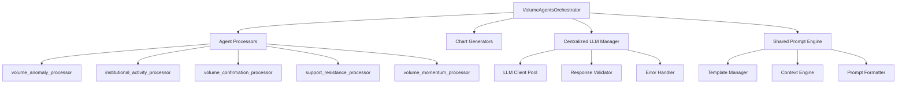
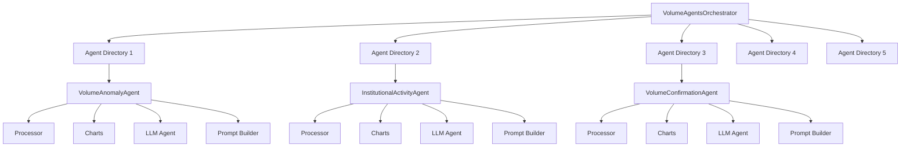

# Volume Agents LLM Architecture Comparison

## 🎯 Current State: Hybrid Architecture (Problematic)

Currently we have **3 different patterns** across 5 agents:
- **Dedicated LLM Agents** (2): `support_resistance`, `volume_confirmation` 
- **Backend/LLM Clients** (2): `institutional_activity`, `volume_momentum`
- **Legacy GeminiClient** (1): `volume_anomaly`

**Problems with Hybrid Approach:**
- ❌ **Inconsistent architecture** - developers need to understand 3 patterns
- ❌ **Mixed complexity** - some agents are simple, others self-contained
- ❌ **Maintenance overhead** - changes require understanding multiple systems
- ❌ **Testing complexity** - different testing strategies for each pattern
- ❌ **Code duplication** - prompt building logic scattered across systems

---

## 🏢 APPROACH 1: Centralized Orchestrator Pattern

**Philosophy**: All LLM calls handled by `volume_agents.py` with shared infrastructure

### 🏗️ Architecture Design



### 📁 File Structure
```
backend/agents/volume/
├── volume_agents.py                 # Central orchestrator + LLM manager
├── shared/
│   ├── llm_manager.py              # Centralized LLM handling
│   ├── prompt_engine.py            # Shared prompt building
│   ├── template_manager.py         # Template loading/caching
│   └── context_builder.py          # Context engineering
├── volume_anomaly/
│   ├── processor.py                # Data processing only
│   └── charts.py                   # Chart generation only
├── institutional_activity/
│   ├── processor.py                # Data processing only
│   └── charts.py                   # Chart generation only
├── [... other agents similar]
```

### 🔧 Implementation Details

#### Central LLM Manager
```python
class CentralizedLLMManager:
    def __init__(self):
        self.llm_clients = {
            'volume_anomaly': get_llm_client("volume_agent"),
            'institutional_activity': get_llm_client("institutional_activity_agent"),
            'volume_confirmation': get_llm_client("volume_confirmation_agent"),
            'support_resistance': get_llm_client("volume_agent"), 
            'volume_momentum': get_llm_client("volume_momentum_agent")
        }
        self.prompt_engine = SharedPromptEngine()
        
    async def analyze_agent(self, agent_name: str, analysis_data: Dict, 
                           chart_image: bytes, symbol: str) -> str:
        # Centralized LLM call logic
        prompt = self.prompt_engine.build_prompt(agent_name, analysis_data, symbol)
        client = self.llm_clients[agent_name]
        return await client.generate(prompt=prompt, images=[chart_image])
```

#### Shared Prompt Engine
```python
class SharedPromptEngine:
    def __init__(self):
        self.templates = self._load_all_templates()
        self.context_builder = ContextBuilder()
    
    def build_prompt(self, agent_name: str, analysis_data: Dict, symbol: str) -> str:
        template = self.templates[agent_name]
        context = self.context_builder.build_context(agent_name, analysis_data, symbol)
        return template.format(context=context)
```

#### Orchestrator Integration
```python
# In volume_agents.py
async def _execute_agent(self, agent_name, config, stock_data, symbol):
    # 1. Data processing (unchanged)
    analysis_data = await self._process_data(agent_name, stock_data)
    
    # 2. Chart generation (unchanged)  
    chart_image = await self._generate_chart(agent_name, stock_data, analysis_data)
    
    # 3. Centralized LLM call
    llm_response = await self.llm_manager.analyze_agent(
        agent_name, analysis_data, chart_image, symbol
    )
    
    return VolumeAgentResult(...)
```

---

## 🎯 APPROACH 2: Distributed Agent Pattern

**Philosophy**: Each agent is completely self-contained with internal LLM handling

### 🏗️ Architecture Design



### 📁 File Structure
```
backend/agents/volume/
├── volume_agents.py                 # Simple orchestrator (coordination only)
├── volume_anomaly/
│   ├── agent.py                    # Master agent class
│   ├── processor.py                # Data processing
│   ├── charts.py                   # Chart generation  
│   ├── llm_agent.py               # LLM integration
│   └── prompt_builder.py          # Agent-specific prompts
├── institutional_activity/
│   ├── agent.py                    # Master agent class
│   ├── processor.py                # Data processing
│   ├── charts.py                   # Chart generation
│   ├── llm_agent.py               # LLM integration  
│   └── prompt_builder.py          # Agent-specific prompts
├── [... other agents similar]
```

### 🔧 Implementation Details

#### Self-Contained Agent
```python
class VolumeAnomalyAgent:
    def __init__(self):
        self.processor = VolumeAnomalyProcessor()
        self.charts = VolumeAnomalyCharts()
        self.llm_agent = VolumeAnomalyLLMAgent()
        self.prompt_builder = VolumeAnomalyPromptBuilder()
    
    async def analyze_complete(self, stock_data: pd.DataFrame, 
                              symbol: str) -> VolumeAgentResult:
        # Complete analysis pipeline within agent
        analysis_data = self.processor.process_volume_anomaly_data(stock_data)
        chart_image = self.charts.generate_volume_anomaly_chart(
            stock_data, analysis_data, symbol)
        
        llm_response = await self.llm_agent.analyze_with_llm(
            analysis_data, chart_image, symbol)
        
        return VolumeAgentResult(
            agent_name="volume_anomaly",
            analysis_data=analysis_data,
            chart_image=chart_image, 
            llm_response=llm_response
        )
```

#### Agent-Specific LLM Integration
```python
class VolumeAnomalyLLMAgent:
    def __init__(self):
        self.llm_client = get_llm_client("volume_agent")
        self.prompt_builder = VolumeAnomalyPromptBuilder()
    
    async def analyze_with_llm(self, analysis_data: Dict, 
                              chart_image: bytes, symbol: str) -> str:
        prompt = self.prompt_builder.build_comprehensive_prompt(
            analysis_data, symbol)
        return await self.llm_client.generate(
            prompt=prompt, images=[chart_image])
```

#### Simple Orchestrator
```python
# In volume_agents.py  
async def _execute_agent(self, agent_name, config, stock_data, symbol):
    # Simple delegation to self-contained agent
    agent_instance = config['agent_instance']
    return await agent_instance.analyze_complete(stock_data, symbol)
```

---

## 📊 Detailed Comparison

### 1. **Maintainability**

| Aspect | Centralized | Distributed |
|--------|------------|-------------|
| **Code Organization** | ⚠️ Complex central system | ✅ Clear separation by agent |
| **Change Isolation** | ❌ Changes affect all agents | ✅ Changes isolated to agent |
| **Bug Tracking** | ❌ Bugs can affect multiple agents | ✅ Bugs isolated to agent |
| **Code Reviews** | ❌ Complex reviews across systems | ✅ Simple, focused reviews |
| **Debugging** | ❌ Complex debugging paths | ✅ Clear, localized debugging |

**Winner: Distributed** ✅

### 2. **Scalability**

| Aspect | Centralized | Distributed |
|--------|------------|-------------|
| **Adding New Agents** | ❌ Modify central system | ✅ Just add new agent directory |
| **Performance Scaling** | ⚠️ Central bottleneck possible | ✅ Independent scaling |
| **Resource Management** | ✅ Shared resource optimization | ⚠️ Some resource duplication |
| **Parallel Execution** | ⚠️ Shared locks possible | ✅ True parallelism |
| **Memory Usage** | ✅ Shared templates/clients | ❌ More memory per agent |

**Winner: Distributed** ✅

### 3. **Testability**

| Aspect | Centralized | Distributed |
|--------|------------|-------------|
| **Unit Testing** | ❌ Complex mocking required | ✅ Simple, isolated testing |
| **Integration Testing** | ❌ Full system required | ✅ Agent-level integration |
| **Test Isolation** | ❌ Tests can interfere | ✅ Perfect test isolation |
| **Mock Complexity** | ❌ Must mock central systems | ✅ Simple mocking |
| **Test Speed** | ❌ Slower due to complexity | ✅ Fast, focused tests |

**Winner: Distributed** ✅

### 4. **Development Velocity**

| Aspect | Centralized | Distributed |
|--------|------------|-------------|
| **Team Parallelism** | ❌ Teams block on central system | ✅ Teams work independently |
| **Learning Curve** | ❌ Must understand whole system | ✅ Focus on one agent at a time |
| **Deployment Risk** | ❌ Changes affect all agents | ✅ Deploy agents independently |
| **Feature Development** | ❌ Coordinate with central team | ✅ Independent feature dev |
| **Rollback Complexity** | ❌ Complex rollbacks | ✅ Simple, isolated rollbacks |

**Winner: Distributed** ✅

### 5. **Code Reuse & DRY**

| Aspect | Centralized | Distributed |
|--------|------------|-------------|
| **Prompt Templates** | ✅ Shared template system | ❌ Duplicated template logic |
| **LLM Clients** | ✅ Shared client pool | ⚠️ Multiple client instances |
| **Error Handling** | ✅ Centralized error logic | ❌ Duplicated error handling |
| **Validation Logic** | ✅ Shared validation | ❌ Per-agent validation |
| **Utility Functions** | ✅ Shared utilities | ⚠️ Some duplication |

**Winner: Centralized** ✅

### 6. **Performance**

| Aspect | Centralized | Distributed |
|--------|------------|-------------|
| **Execution Speed** | ⚠️ Central processing overhead | ✅ Direct execution paths |
| **Memory Efficiency** | ✅ Shared resources | ❌ Higher memory usage |
| **CPU Efficiency** | ⚠️ Context switching overhead | ✅ Optimized per agent |
| **Network Efficiency** | ✅ Connection pooling | ⚠️ Multiple connections |
| **Startup Time** | ❌ Complex initialization | ✅ Fast, parallel startup |

**Winner: Distributed** ✅

### 7. **Error Handling & Resilience**

| Aspect | Centralized | Distributed |
|--------|------------|-------------|
| **Error Isolation** | ❌ Errors can cascade | ✅ Errors isolated to agent |
| **Recovery Logic** | ✅ Centralized recovery | ❌ Duplicated recovery |
| **Monitoring** | ✅ Centralized monitoring | ❌ Distributed monitoring |
| **Circuit Breakers** | ✅ Shared circuit breakers | ❌ Per-agent breakers |
| **Failure Independence** | ❌ Central point of failure | ✅ Independent failures |

**Winner: Tie** ⚖️

### 8. **Configuration Management**

| Aspect | Centralized | Distributed |
|--------|------------|-------------|
| **Config Complexity** | ✅ Single config system | ❌ Multiple config points |
| **Config Changes** | ✅ Centralized updates | ❌ Multiple update points |
| **Environment Management** | ✅ Unified environments | ⚠️ Environment per agent |
| **Secrets Management** | ✅ Shared secret handling | ❌ Distributed secrets |
| **Feature Flags** | ✅ Centralized flags | ❌ Per-agent flags |

**Winner: Centralized** ✅

### 9. **Complexity**

| Aspect | Centralized | Distributed |
|--------|------------|-------------|
| **Cognitive Load** | ❌ High - understand whole system | ✅ Low - focus on one agent |
| **Architecture Complexity** | ❌ Complex central system | ✅ Simple, repeated patterns |
| **Data Flow** | ❌ Complex routing logic | ✅ Clear, direct flow |
| **Dependency Management** | ❌ Complex interdependencies | ✅ Simple, isolated deps |
| **Documentation Needs** | ❌ Extensive documentation | ✅ Self-documenting agents |

**Winner: Distributed** ✅

---

## 🏆 Overall Scoring

### Centralized Orchestrator Pattern
- ✅ **Strengths**: Code reuse, configuration management
- ❌ **Weaknesses**: Maintainability, scalability, testability, complexity
- **Score**: 3/9 categories won

### Distributed Agent Pattern  
- ✅ **Strengths**: Maintainability, scalability, testability, development velocity, performance, complexity
- ❌ **Weaknesses**: Code reuse, configuration management
- **Score**: 6/9 categories won

---

## 💡 Recommendation: **Distributed Agent Pattern**

### Why Distributed Wins

1. **🎯 Better Development Experience**
   - Teams can work independently
   - Simple, focused codebase per agent
   - Fast testing and debugging cycles

2. **🚀 Superior Scalability** 
   - Easy to add new agents
   - True parallel execution
   - Independent performance optimization

3. **🛡️ Better Resilience**
   - Failures isolated to individual agents
   - No central point of failure
   - Independent recovery mechanisms

4. **🔧 Lower Complexity**
   - Each agent is simple to understand
   - Clear, direct execution paths
   - Self-contained components

### Addressing Distributed Pattern's Weaknesses

#### Code Reuse Solution:
```python
# Create shared utilities without central control
backend/agents/volume/shared/
├── base_llm_agent.py           # Base class for LLM agents
├── base_prompt_builder.py      # Base class for prompt builders  
├── common_templates.py         # Shared template utilities
└── validation_utils.py         # Shared validation logic
```

#### Configuration Management Solution:
```python
# Unified configuration with agent independence
class AgentConfigManager:
    def get_agent_config(self, agent_name: str):
        # Returns agent-specific config while maintaining central management
        return self.unified_config[f"{agent_name}_agent"]
```

---

## 🔄 Migration Strategy

### Phase 1: Standardize to Distributed Pattern
1. **Migrate `institutional_activity`** and **`volume_momentum`** from orchestrator-based to self-contained
2. **Create shared base classes** to reduce duplication
3. **Update orchestrator** to simple delegation pattern

### Phase 2: Optimize  
1. **Add shared utilities** for common functionality
2. **Implement unified configuration** management
3. **Create testing framework** for distributed agents

### Phase 3: Scale
1. **Add new agents** using the distributed pattern
2. **Performance optimization** per agent
3. **Independent deployment** capabilities

---

## 🎉 Final Recommendation

**Choose the Distributed Agent Pattern** because:

✅ **Better for teams** - independent development  
✅ **Better for testing** - isolated, fast tests  
✅ **Better for scaling** - add agents easily  
✅ **Better for maintenance** - clear ownership  
✅ **Better for performance** - optimized execution  
✅ **Lower risk** - isolated failures  
✅ **Simpler architecture** - easy to understand  

The benefits far outweigh the minor code duplication concerns, which can be addressed with shared base classes and utilities while maintaining the independence that makes this pattern superior.